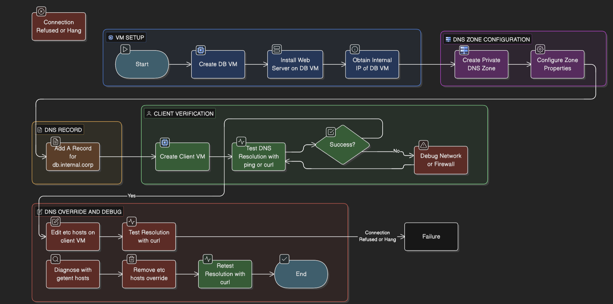
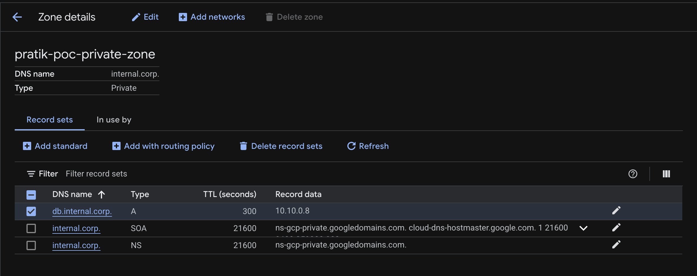

## 🎯 The Objective
In the physical world, "Identity" (Who you are) and "Location" (Where you are) are different.
In the cloud:
* **Identity** = Hostname (`db.internal.corp`)
* **Location** = IP Address (`10.128.0.5`)

If you hardcode IPs in your application, you break this separation. Today, we are going to build a **Private DNS Zone**. This creates a "Split Reality" where your internal servers can find each other using friendly names that the public internet doesn't know exist.



---

## 🏗️ Phase 1: The Infrastructure
We need a "Database" (Target) and a "Client" (Tester).

**1. Create the Target VM (`db-vm`)**
* **Name:** `db-vm`
* **Region:** `us-central1`
* **Network:** Default
* **Startup Script:** Let's install a tiny web server so we can test it.
    ```bash
    #! /bin/bash
    echo "<h1>I am the Database</h1>" > index.html
    python3 -m http.server 80
    ```
* **Note the Internal IP:** (e.g., `10.128.0.5`).

**2. Create the Client VM (`client-vm`)**
* **Name:** `client-vm`
* **Region:** `us-central1` (Same as DB).
* **Purpose:** This will be our testing machine.

---

## 📒 Phase 2: The Private Zone (The Phonebook)
Now we create the "Private Reality."

**1. Create the Zone**
* Go to **Network Services** > **Cloud DNS**.
* Click **Create Zone**.
* **Zone Type:** **Private** (Crucial!).
* **Zone Name:** `internal-corp-zone`
* **DNS Name:** `internal.corp`
* **Networks:** Select `default`.

**2. Add the Record**
* Click **Add Standard Record Set**.
* **DNS Name:** `db` (Full name: `db.internal.corp`).
* **Type:** `A`
* **IPv4 Address:** Enter the internal IP of `db-vm` (from Phase 1).



---

## ✅ Phase 3: Verification
Now, let's prove that names are better than numbers.

**1. SSH into `client-vm`**

**2. Test Resolution:**
```bash
# Ask the OS: "Who is db.internal.corp?"
ping -c 2 db.internal.corp
```
You should see it resolving to 10.x.x.x.

**3. Test Connection:**
```bash
curl db.internal.corp
```
Output: `<h1>I am the Database</h1>`


---

## 🕵️ Phase 4: The Sabotage (Troubleshooting)
Let's learn why "It's always DNS." We will manually lie to the OS using the `/etc/hosts` file.

**1. The Lie:**
Open the hosts file on `client-vm`:
```bash
sudo nano /etc/hosts
```
Add this line at the bottom:
```
1.1.1.1 db.internal.corp
```
Save and Exit (`Ctrl+O`, `Enter`, `Ctrl+X`).

**2. The Failure:**
Try to curl again:
```bash
curl db.internal.corp
```
Result: It hangs or fails.

**Why?** Linux checks the "Sticky Note" (`/etc/hosts`) before checking the official Phonebook (Cloud DNS).

**3. The Fix:**
Remove the line from `/etc/hosts`. The connection will work immediately.

---

## 📺 NotebookLM Video Overview
Watch the AI-generated summary of today's lab concepts.

<iframe width="100%" height="315" src="https://www.youtube.com/embed/92cwKCU8Z5c?si=nVYfcoDyImyU0jh3" title="Day 06 NotebookLM Overview" frameborder="0" allow="accelerometer; autoplay; clipboard-write; encrypted-media; gyroscope; picture-in-picture" allowfullscreen></iframe>

---

## 🧠 Key Takeaways
* **Split-Horizon:** You can have a private "internet" inside your VPC that the outside world cannot see.
* **Order of Operations:** Linux checks `/etc/hosts` → DNS Cache → DNS Server.
* **Decoupling:** DNS allows you to move a server (change IP) without breaking the application (hostname stays the same).
