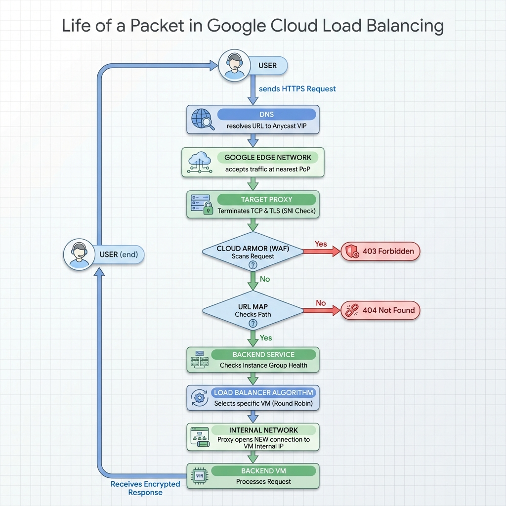

## 🎯 The Objective
In the cloud, we often click "Create Load Balancer" and treat it as a magic black box. But what is actually happening inside?

Today, we break the magic. We will build a **Layer 7 Load Balancer** from scratch using **Nginx**.
Our goal is to understand the First Principles:
1.  **The Reverse Proxy:** The "Gateway" that terminates your connection and opens a new one to the backend.
2.  **The Upstream:** The "Backend Service" that manages a pool of IPs.
3.  **Resilience:** How the system survives a zonal outage without the user noticing.

---

## 🏗️ Phase 1: The Architecture (Manager vs. Workers)
We are building a High Availability cluster in the `asia-south1` (Mumbai) region.

* **The Workers (Backends):** Two simple Python web servers. We place them in **Different Zones** (`Zone A` and `Zone B`). This simulates two separate physical data centers.
* **The Manager (Load Balancer):** An Nginx server in `Zone C`. It acts as the single entry point.

**Step 1: The Setup**
We spin up 3 VMs. The backends run a startup script that creates a custom `index.html` so we can identify them.

*[IMAGE PLACEHOLDER: vm-setup.png]*

**The Nginx Logic (The Brain):**
We configure Nginx (`/etc/nginx/sites-available/default`) to act as the proxy. This file maps the cloud concepts to code:

```nginx
# 1. THE BACKEND SERVICE (Upstream Block)
# This is our pool of healthy workers.
upstream my_backend_pool {
    server 10.128.0.2;  # Backend A (Zone A)
    server 10.128.0.3;  # Backend B (Zone B)
}

# 2. THE URL MAP (Location Block)
server {
    listen 80;
    location / {
        # 3. THE PROXY (Forwarding Rule)
        proxy_pass http://my_backend_pool;
    }
}
```

---

## 🔄 Phase 2: Round Robin & Failover
**1. Round Robin Test:** By default, Nginx uses Round Robin. When we `curl` the Manager's IP, it takes turns: Backend A -> Backend B -> Backend A -> Backend B.

**2. The "Kill" Test:** We simulated a Data Center failure by stopping Backend A:

```bash
gcloud compute instances stop backend-a --zone=asia-south1-a
```

We immediately hit the Manager again.

**Result:** Nginx detected the failure (Passive Health Check), marked A as "Dead," and instantly routed 100% of traffic to Backend B. The user experienced zero downtime.

---

## 🧠 Phase 3: Advanced Logic (Sticky & Weighted)
We explored two critical configurations:

### 1. Sticky Sessions (Session Affinity)
We added `ip_hash;` to the upstream block.

**Effect:** My specific IP address was "glued" to Backend A.

**The Trade-off:** While this preserves user state (like a shopping cart), it breaks true load balancing. If one office with 5,000 users shares an IP, they all hammer one server.

**Modern Fix:** Keep the LB "Stateless" and store the cart in Redis.

### 2. Weighted Balancing (Canary)
We assigned `weight=3` to Backend A and `weight=1` to Backend B.

**Effect:** Backend A took 75% of the traffic. This is exactly how Canary Deployments work (slowly shifting traffic to a new version).

---

## 🔬 Deep Dive: The Life of a Packet
It is not enough to just know which buttons to click. To be a Security Architect, you must understand the journey of a single packet through the Google SDN.



**The Flow:**

1. **Resolution:** User queries DNS -> Resolves to the Anycast VIP (Public IP).
2. **Ingress:** The request reaches the nearest Google Edge Point of Presence (PoP).
3. **L4 Termination:** Google terminates the user's TCP connection at the Edge.
4. **Identity (SNI):** The Edge checks the Server Name Indication to select the correct SSL Certificate and decrypts the traffic (TLS Termination).
5. **Security (WAF):** Cloud Armor scans the decrypted payload for malicious patterns (SQLi, XSS). If bad, it blocks (403).
6. **Routing (UrlMap):** The Proxy inspects the path (`/app` vs `/images`) to decide which Backend Service to use.
7. **Selection:** The Backend Service checks the Health Status of the Instance Group. It filters out dead VMs.
8. **Distribution:** It applies the algorithm (Round Robin/Sticky) to pick one healthy VM (e.g., `10.128.0.5`).
9. **Forwarding:** The Proxy initiates a NEW TCP connection to the VM's Internal IP.
10. **Processing:** The VM processes the request and sends the response back to the Proxy, which encrypts it and sends it to the user.

---

## 📝 Key Takeaways
* **L7 Awareness:** A Layer 7 LB doesn't just forward packets; it terminates the connection, reads the request, and makes intelligent decisions (Routing).
* **Health Checks:** You don't need a complex monitoring tool for basic HA; the LB passively monitors response codes.
* **State Matters:** Sticky Sessions are a quick fix for legacy apps, but "Stateless + Redis" is the architecture of champions.
